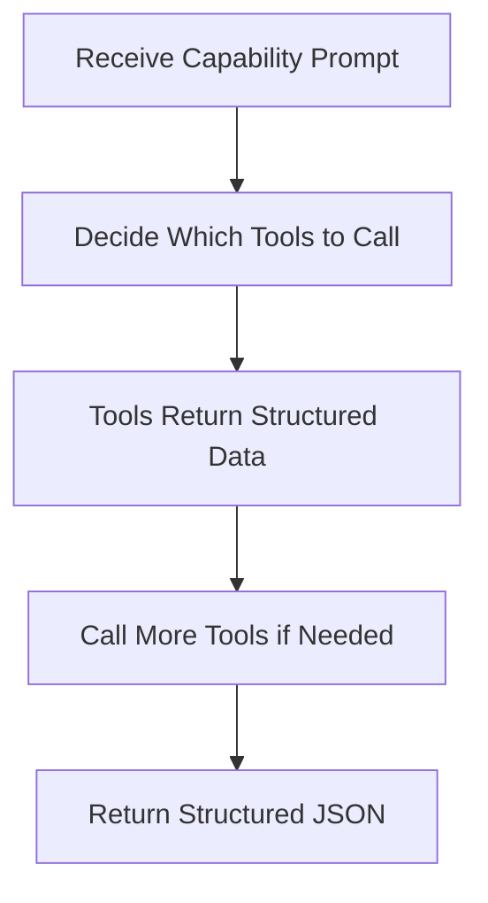

# Iris Agent System

The Iris Agent is the core intelligence of Git-Iris, built on [Rig 0.42](https://docs.rs/rig/0.42.0) (the `rig` facade crate) for agentic workflows.

**Source:** `src/agents/iris.rs`

## Design Philosophy

### One Agent to Rule Them All

Git-Iris uses a unified agent architecture with capability switching. The following sketch shows
the configuration fields; the implementation also holds shared workspace and execution state:

```rust
pub struct IrisAgent {
    provider: String,              // Provider registry name
    model: String,                 // Primary model for complex tasks
    fast_model: Option<String>,    // Lightweight status model
    current_capability: Option<String>, // Active capability
    provider_config: HashMap<String, String>,
    preamble: Option<String>,
    config: Option<Config>,
    content_update_sender: Option<ContentUpdateSender>,
}
```

**Benefits:**

- **Code reuse** — Tools, validation, and execution logic shared across all capabilities
- **Consistency** — Same decision-making process for commits, reviews, PRs, etc.
- **Maintainability** — Fix a bug once, it's fixed everywhere
- **Testability** — Test one agent with different prompts

### Provider Construction

The provider module creates clients through one `agent_builder` entry point. Rig 0.42 erases the
completion model type inside its agent, so `DynAgent` wraps one shared agent type. OpenAI uses
Responses, OpenRouter uses its native adapter, and Fireworks uses an OpenAI-compatible Chat
Completions client. Anthropic and Gemini retain their native adapters.

API keys resolve from provider configuration, then the provider's environment variable. Service
entry points bind repository identity and execution trust for tool calls. Parallel workers carry
both values into spawned tasks; remote clones cannot run project build scripts through static analysis.

## Agent Lifecycle

### 1. Creation

```rust
// Direct creation
let agent = IrisAgent::new("anthropic", "claude-opus-5")?;

// With builder
let agent = IrisAgentBuilder::new()
    .with_provider("anthropic")
    .with_model("claude-opus-5")
    .with_preamble("Custom instructions...")
    .build()?;
```

### 2. Configuration

Agents can be configured with:

- **Subagent model** for delegated analysis: set `providers.<name>.subagent_model` in the config
- **Config** for gitmoji/presets: `agent.set_config(config)`
- **Content update sender** for Studio chat mode: `agent.set_content_update_sender(sender)`

### 3. Execution

```rust
let response = agent.execute_task("commit", "Generate a commit message").await?;

match response {
    StructuredResponse::CommitMessage(msg) => {
        println!("{} {}", msg.emoji.unwrap_or_default(), msg.title);
    }
    _ => {}
}
```

### 4. Streaming (for TUI)

```rust
agent.execute_task_streaming("review", prompt, |chunk, aggregated| {
    // Update TUI with each text chunk
    print!("{}", chunk);
}).await?;
```

## Tool Attachment

The shared `build_agent` path creates a focused subagent and main agent using the selected
provider. It applies `CompletionProfile::Subagent` and `CompletionProfile::MainAgent` through
`apply_completion_params`, then attaches their tools.

The main agent receives the core registry plus repository metadata, a persistent workspace,
`ParallelAnalyze`, and the focused subagent through Rig's `dynamic_tool` adapter. Studio chat adds
content-update tools when a sender is present. Subagents receive core tools without delegation.

Provider parameter mapping lives in `src/agents/provider.rs`. OpenAI gets Responses reasoning;
Opus gets adaptive thinking and effort; Gemini gets generation configuration. Anthropic's builder
enables automatic prompt caching. Explicit model choices and provider parameters remain configurable.

### Tool Registry Pattern

The `attach_core_tools!` macro ensures consistency. It wires **eleven** core tools — every Git source of evidence, file/code access, repository orientation, linter execution, and project documentation:

```rust
#[macro_export]
macro_rules! attach_core_tools {
    ($builder:expr) => {{
        use $crate::agents::debug_tool::DebugTool;
        use $crate::agents::tools::{
            CodeSearch, FileRead, GitBlame, GitChangedFiles, GitDiff, GitLog, GitShow, GitStatus,
            ProjectDocs, RepoMapTool, StaticAnalysis,
        };

        $builder
            .tool(DebugTool::new(GitStatus))
            .tool(DebugTool::new(GitDiff))
            .tool(DebugTool::new(GitLog))
            .tool(DebugTool::new(GitShow))
            .tool(DebugTool::new(GitChangedFiles))
            .tool(DebugTool::new(GitBlame))
            .tool(DebugTool::new(FileRead))
            .tool(DebugTool::new(CodeSearch))
            .tool(DebugTool::new(RepoMapTool))
            .tool(DebugTool::new(StaticAnalysis))
            .tool(DebugTool::new(ProjectDocs))
    }};
}
```

The companion `CORE_TOOLS: &[&str]` constant in `src/agents/tools/registry.rs` lists the same eleven names, and a unit test asserts the count stays at 11.

**Prevents drift** — Main agents and subagents always have the same core tools. Delegation tools (`Workspace`, `ParallelAnalyze`, the sub-agent itself) are attached only to the main agent so subagents can't recurse.

## Multi-Turn Execution

Iris operates in **multi-turn mode**, with a budget of 50 model turns. A turn may contain multiple tool calls. The non-streaming path calls `prompt_extended` on `DynAgent`, which chains `max_turns(depth).extended_details()` on the shared agent:

```rust
let prompt_response: PromptResponse = agent.prompt_extended(&full_prompt, 50).await?;
// inside DynAgent::prompt_extended:
self.0.prompt(msg).max_turns(depth).extended_details().await
```

Streaming uses the same shared agent builder and calls `.stream_prompt(...).max_turns(50).await`. Both paths use the configured model, tools, and task contract.

### Execution Flow



| Step           | Action                            | Example                                               |
| -------------- | --------------------------------- | ----------------------------------------------------- |
| **1. Receive** | Load prompt from capability TOML  | "Generate a commit message for staged changes..."     |
| **2. Decide**  | Iris selects which tools to call  | `git_diff()`, `project_docs()`, `git_log(count=5)`    |
| **3. Execute** | Tools return structured data      | Diff with scores, compact doc context, recent commits |
| **4. Iterate** | Call more tools based on findings | `file_read()` to examine specific files               |
| **5. Return**  | Generate structured JSON response | `{ emoji: "✨", title: "...", message: "..." }`       |

**Why 50 turns?** Complex capabilities like PRs and release notes may need to:

- Analyze 20+ changed files individually
- Read commit history across a feature branch
- Search for patterns in configuration files
- Spawn parallel subagents for deep analysis

Iris knows when to stop, so we provide generous headroom.

## Capability Loading

Capabilities are embedded at compile time and loaded dynamically. There are **eight** capability TOML files: seven user-facing capabilities plus the internal `verify` capability used by the critic pass.

```rust
fn load_capability_config(&self, capability: &str) -> Result<(String, String)> {
    // The verify capability is handled separately so the critic pass can be cached
    if capability == "verify" {
        return Self::load_verify_capability_config(); // uses CAPABILITY_VERIFY
    }

    let content = match capability {
        "commit" => CAPABILITY_COMMIT,
        "pr" => CAPABILITY_PR,
        "review" => CAPABILITY_REVIEW,
        "changelog" => CAPABILITY_CHANGELOG,
        "release_notes" => CAPABILITY_RELEASE_NOTES,
        "chat" => CAPABILITY_CHAT,
        "semantic_blame" => CAPABILITY_SEMANTIC_BLAME,
        _ => return Ok(("Generic prompt".to_string(), "PlainText".to_string())),
    };

    let parsed: toml::Value = toml::from_str(content)?;
    let task_prompt = parsed.get("task_prompt")...;
    let output_type = parsed.get("output_type")...;

    Ok((task_prompt.to_string(), output_type))
}
```

The tuple `(task_prompt, output_type)` determines:

- **What Iris is asked to do** (the prompt)
- **What format to return** (JSON schema type)

### Critic Verification Pass

After `execute_output_type` returns a structured response, `execute_task` calls `verify_response_if_enabled`. When the critic is enabled (default `Config.critic_enabled = true`), Iris loads the `verify` capability — whose `output_type = "Critique"` — and runs it as an `execute_with_agent::<Critique>` call against the serialized artifact and the original task. The default set is reviews, PR descriptions, changelogs, and release notes; commit messages use the critic only when `gen --critic` opts in.

`Critique` has four fields: `requires_revision: bool`, `issues: Vec<CritiqueIssue>` (title, body, severity), `revision_prompt: String`, `confidence: u8`. If the critic returns `requires_revision = true` and provides either issues or a revision prompt, `execute_output_type` runs once more with the original system prompt and a user prompt augmented with the critic feedback. The pass runs only for output types where a critic check pays off:

The enabled critic handles review, PR, changelog, and release-note output. Commit generation also
requires an explicit critic override. Chat and semantic blame do not run the critic.

Critic evaluation failures (loading, parsing, or network errors) are logged as warnings and preserve
the original artifact. If the critic requests a revision and that generation fails, the error
propagates to the caller.

## Structured Output Generation

Structured capabilities derive their response schema from the Rust output type. The capability,
style, and response contract belong in the trusted preamble; the task and its repository context
remain separate. The final response is parsed into the expected type, with recovery for supported
formatting errors. Prompt instructions are not a substitute for response validation.

See [Prompt Contracts](./prompting) for instruction precedence and evaluation coverage.

### JSON Extraction and Sanitization

**Extract:** Handles multiple formats

- Pure JSON: `{"emoji": "✨", ...}`
- Markdown code block: ` ```json\n{...}\n``` `
- With preamble: `Here's the commit message:\n{...}`

**Sanitize:** Fixes common LLM mistakes

- Literal newlines in strings → `\n`
- Unescaped control characters → Unicode escapes
- Tab characters → `\t`

**Validate:** Schema-aware recovery

- Missing fields → Add defaults
- Type mismatches → Coerce to expected type
- Null where not allowed → Replace with defaults

See [Output Validation](./output.md) for details.

## Style Injection

Iris applies capability-appropriate presets and explicit emoji settings before generation. The
conventional preset defines commit format; it does not impose commit fields on reviews or release
notes. An explicit emoji setting overrides inferred history. Without an explicit commit format,
Iris uses the prevailing repository convention rather than a single exceptional commit.

The shared `get_gitmoji_prompt_guide()` supplies valid gitmoji choices when emoji styling applies.
Tone presets change wording while preserving facts, identifiers, and the output schema. Persisted
custom instructions apply across capabilities; invocation and temporary instructions take precedence.

## Subagent Creation

Iris exposes a focused `analyze_subagent` tool and a `parallel_analyze` tool for independent tasks.
Both use `subagent_model` when configured, otherwise the primary model. The fast model is reserved
for status messages.

Subagents receive the core registry, a focused preamble, and 4,096 output tokens. They have no
further delegation tools. The primary agent receives 16,384 output tokens. Configured turn and
time budgets govern delegated tasks, and each worker retains the originating repository and trust.

Reasoning is selected by `CompletionProfile::Subagent`: low for Astra, Opus, and Gemini 3.8.
Fireworks DeepSeek V4 uses high because its API promotes low and medium to high.

## Provider-Specific Handling

### OpenAI Model Defaults

Git-Iris defaults to GPT-6 Astra for OpenAI analysis and GPT-5.6 Luna for status messages. Keep examples and docs aligned with the current defaults in `src/providers.rs` rather than older model aliases.

### Anthropic Prompt Caching

`anthropic_agent_builder` calls `.with_automatic_caching()` on every Anthropic completion model (`src/agents/provider.rs`). Rig places a top-level `cache_control` breakpoint on the last cacheable block, which the API advances as the conversation grows. On Iris's multi-turn tool loops, where every turn otherwise re-sends the whole transcript at full input price, cached turns are billed at a fraction of that cost. Caching is unconditional — prompts below the model's cacheable minimum are simply not cached by the API. Debug output surfaces both `cache_creation_input_tokens` and `cached_input_tokens` so you can confirm the cache is doing real work on your workload.

## Streaming Support

Streaming uses the same configured agent, tool registry, response schema, and critic policy as
non-streaming generation. The output contract lives in the trusted preamble; the user message
carries the task once.

Studio receives provisional text and tool activity while the agent runs. The collector resets the
preview between tool turns and parses Rig's final response, so intermediate narration cannot become
the artifact. Structured output uses the same Rust types and recovery path in both modes.

When the critic requests a revision, the revision prompt includes the original artifact and the
material corrections. Studio receives the final typed result after verification finishes.

## Debug Instrumentation

All agent operations are instrumented for debugging:

```rust
use crate::agents::debug;

debug::debug_phase_change("AGENT EXECUTION: GeneratedMessage");
debug::debug_context_management("Agent built with tools", "Provider: anthropic...");
debug::debug_llm_request(&full_prompt, Some(16384));

let timer = debug::DebugTimer::start("Agent prompt execution");
let prompt_response = agent.prompt_extended(&full_prompt, 50).await?;
let response = &prompt_response.output;
timer.finish();

debug::debug_llm_response(&response, duration, Some(total_tokens));
debug::debug_json_parse_success("GeneratedMessage");
```

Enable with `--debug` flag for color-coded execution traces.

## Testing Patterns

Capability tests parse the embedded TOMLs and verify their output types. Runtime tests in
`src/agents/iris_runtime_tests.rs` use a local HTTP server to inspect actual provider requests and
exercise multi-turn tool calls without paid API access. Studio tests follow draft updates from the
tool through the event channel into typed state.

Run the focused runtime suite with:

```bash
cargo test --locked --lib iris_runtime_tests
```

Live model evaluations are separate. Use a disposable repository, hold the model and task fixed,
and compare observed behavior before and after the prompt change. See [Prompt Contracts](./prompting.md).

## Error Handling

Agent errors are propagated with context:

```rust
// Provider error
Err(anyhow::anyhow!("Failed to create agent builder for provider '{}': {}", provider, e))

// JSON parsing error
Err(anyhow::anyhow!("No valid JSON found in response"))

// Validation error
Err(anyhow::anyhow!("Failed to parse JSON even after recovery attempts: {}", e))
```

All errors flow through `anyhow::Result` for rich error context.

## Next Steps

- [Capabilities](./capabilities.md) — How to create custom task definitions
- [Tools](./tools.md) — Building and registering tools for Iris
- [Output Validation](./output.md) — Schema validation and error recovery
