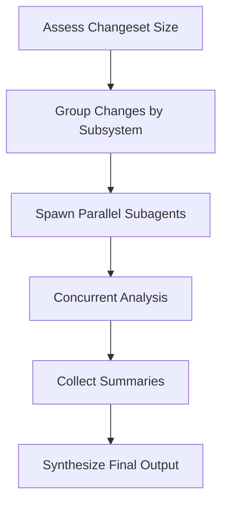

# Context Strategy

Git-Iris uses **adaptive context management** to handle changesets of any size — from single-line tweaks to massive refactors. The key is **relevance scoring**: intelligently prioritizing what Iris should focus on.

**Source:** `src/agents/tools/git.rs`, `src/agents/capabilities/*.toml`

## The Context Problem

### Token Limits Are Real

Even with large context windows (200K tokens), dumping entire changesets is problematic:

- **Cognitive overload** — LLMs struggle to synthesize 50+ files
- **Cost explosion** — Every token costs money
- **Latency increase** — Longer prompts = slower responses
- **Diluted attention** — Important changes get lost in noise

### The Solution: Adaptive Strategy

Git-Iris uses a **tiered approach** based on changeset size:

```
Small changeset       →  Full context for everything
Medium changeset      →  Relevance-based filtering
Large changeset       →  Top N files only
Very large changeset  →  Parallel subagent analysis
```

## Relevance Scoring Algorithm

Every changed file gets a **relevance score** (0.0 - 1.0) based on multiple factors:

### Scoring Factors

```rust
fn calculate_relevance_score(file: &StagedFile) -> (f32, Vec<&'static str>) {
    let mut score: f32 = 0.5;  // Base score
    let mut reasons = Vec::new();

    // Factor 1: Change Type
    match file.change_type {
        ChangeType::Added => {
            score += 0.15;
            reasons.push("new file");
        }
        ChangeType::Modified => {
            score += 0.1;
        }
        ChangeType::Deleted => {
            score += 0.05;
            reasons.push("deleted");
        }
    }

    // Factor 2: File Type
    if is_source_code(&file.path) {
        score += 0.15;
        reasons.push("source code");
    } else if is_config(&file.path) {
        score += 0.1;
        reasons.push("config");
    } else if is_docs(&file.path) {
        score += 0.02;
        reasons.push("docs");
    }

    // Factor 3: Path Patterns
    if file.path.contains("/src/") || file.path.starts_with("src/") {
        score += 0.1;
        reasons.push("core source");
    }
    if file.path.contains("/test") {
        score -= 0.1;
        reasons.push("test file");
    }
    if file.path.contains("generated") || file.path.contains(".lock") {
        score -= 0.2;
        reasons.push("generated/lock");
    }

    // Factor 4: Diff Size
    let diff_lines = file.diff.lines().count();
    if diff_lines > 10 && diff_lines < 200 {
        score += 0.1;
        reasons.push("substantive changes");
    } else if diff_lines >= 200 {
        score += 0.05;
        reasons.push("large diff");
    }

    // Factor 5: Semantic Changes
    let semantic_changes = detect_semantic_changes(&file.diff, &file.path);
    for change in semantic_changes {
        if change == "adds function" || change == "adds type" {
            score += 0.1;
        }
        reasons.push(change);
    }

    // Clamp to 0.0-1.0
    score.clamp(0.0, 1.0);
    (score, reasons)
}
```

### Semantic Change Detection

Beyond line counts, Git-Iris detects **structural changes**:

```rust
fn detect_semantic_changes(diff: &str, path: &str) -> Vec<&'static str> {
    let mut changes = Vec::new();
    let ext = get_extension(path);

    for line in diff.lines().filter(|l| l.starts_with('+')) {
        let line = line.trim_start_matches('+').trim();

        // Function definitions
        if is_function_def(line, ext) {
            changes.push("adds function");
        }

        // Type definitions
        if is_type_def(line, ext) {
            changes.push("adds type");
        }

        // Imports/dependencies
        if is_import(line, ext) {
            changes.push("modifies imports");
        }

        // Language-specific patterns
        if ext == "rs" && line.starts_with("impl ") {
            changes.push("adds impl");
        }
    }

    // Refactoring detection
    let has_deletions = diff.lines().any(|l| l.starts_with('-'));
    let has_additions = diff.lines().any(|l| l.starts_with('+'));

    if has_deletions && has_additions && changes.is_empty() {
        changes.push("refactors code");
    }

    changes
}
```

**Supported languages:**

- Rust: `pub fn`, `struct`, `enum`, `impl`, `use`
- TypeScript/JavaScript: `function`, `=>`, `class`, `interface`, `import`
- Python: `def`, `class`, `import`, `from`
- Go: `func`, `type`, `import`

### Example Scoring

```
src/agents/iris.rs
  + 0.5   base score
  + 0.1   modified (vs added)
  + 0.15  source code (.rs)
  + 0.1   core source (src/)
  + 0.1   substantive changes (87 lines)
  + 0.1   adds function
  + 0.1   adds impl
  ─────
  = 1.0   ★★★★★ (95% relevance)

tests/integration_test.rs
  + 0.5   base score
  + 0.1   modified
  + 0.15  source code (.rs)
  - 0.1   test file
  ─────
  = 0.65  ★★★ (65% relevance)

Cargo.lock
  + 0.5   base score
  + 0.1   modified
  - 0.2   lock file
  ─────
  = 0.4   ★★ (40% relevance)
```

## Size-Based Strategies

The `git_diff` tool includes a one-line size label and guidance in its output header. There is no `ChangesetSize` enum — the buckets are computed inline inside `format_diff_output` as a `(size, guidance)` tuple. Three size labels are emitted, plus a `Filtered` label when the caller passes `files` to restrict the diff:

```rust
let (size, guidance) = if is_filtered {
    ("Filtered", "Showing requested files only.")
} else if total_files <= 3 && total_lines < 100 {
    ("Small",  "Inspect the changed contracts and their relevant callers.")
} else if total_files <= 10 && total_lines < 500 {
    ("Medium", "Use relevance to order inspection, not to exclude changes.")
} else {
    ("Large",
     "Use files=['path1','path2'] with detail='standard' to analyze specific files.")
};
```

Capability prompts require coverage of the selected scope without fixed file-count cutoffs.
They leave delegation to the task: independent questions can benefit from workers at any size.
See [Prompt Contracts](./prompting.md) for evidence and completion requirements.

### Output Format

```
=== DIFF SUMMARY ===
Size: Medium (8 files, 347 lines changed)
Guidance: Use relevance to order inspection, not to exclude changes.

=== CHANGES (sorted by relevance) ===

━━━━━━━━━━━━━━━━━━━━━━━━━━━━━━━━━━━━━━━━━━━━━━━━━━━━━━━━━━━━━━━━
📄 src/agents/iris.rs [MODIFIED] ★★★★★ 95% relevance
   Reasons: source code, core source, substantive changes, adds function
━━━━━━━━━━━━━━━━━━━━━━━━━━━━━━━━━━━━━━━━━━━━━━━━━━━━━━━━━━━━━━━━

@@ -310,6 +310,15 @@
 pub struct IrisAgent {
+    /// Fast model for subagents
+    fast_model: Option<String>,
}

━━━━━━━━━━━━━━━━━━━━━━━━━━━━━━━━━━━━━━━━━━━━━━━━━━━━━━━━━━━━━━━━
📄 src/agents/tools/parallel_analyze.rs [MODIFIED] ★★★★★ 92% relevance
   Reasons: source code, core source, adds function, adds type
━━━━━━━━━━━━━━━━━━━━━━━━━━━━━━━━━━━━━━━━━━━━━━━━━━━━━━━━━━━━━━━━

[diff content...]

━━━━━━━━━━━━━━━━━━━━━━━━━━━━━━━━━━━━━━━━━━━━━━━━━━━━━━━━━━━━━━━━
📄 Cargo.lock [MODIFIED] ★★ 40% relevance
   Reasons: generated/lock
━━━━━━━━━━━━━━━━━━━━━━━━━━━━━━━━━━━━━━━━━━━━━━━━━━━━━━━━━━━━━━━━

[omitted due to low relevance - 873 lines of dependency updates]
```

## Detail Levels

The `git_diff` tool supports **two** detail levels — `Summary` (default) and `Standard`. To narrow `Standard` output to a specific subset of files, pass the `files: Vec<String>` argument instead of relying on a third detail level.

### 1. Summary

**Use case:** Quick overview, parallel analysis task planning, first call on any changeset.

**Output:**

- File list with stats
- Relevance scores
- No diffs

```
=== CHANGES SUMMARY ===
8 files | +247 -100 | Size: Medium (347 lines)
Guidance: Use relevance to order inspection, not to exclude changes.

Files by importance:
  [95%] Modified src/agents/iris.rs (source code, adds function)
  [92%] Modified src/agents/tools/parallel_analyze.rs (source code, adds type)
  [78%] Added    src/types/commit.rs (source code, new file)
  [65%] Modified tests/integration_test.rs (test file)
  ...
(Use detail='standard' with files=['file1','file2'] to see specific diffs)
```

### 2. Standard

**Use case:** After scanning the summary, pull full diffs — either for the entire changeset (small/medium) or for a curated set of high-relevance files via `files=[...]`.

**Output:**

- Full unified diffs for every included file
- Relevance scores still attached for Iris's reference
- When `files` is set, the header reports `Size: Filtered`

The progressive flow is intentional: call once with `detail="summary"`, then again with `detail="standard"` and a `files` filter scoped to whatever the relevance scores surfaced.

## Capability-Specific Strategies

Commit generation describes the complete selected changeset. Reviews focus on supported
regressions and their affected contracts. PR descriptions explain the concrete problem and
resulting behavior while preserving existing human context and templates. Relevance scores guide
inspection order across these capabilities, but never define a subset that counts as the whole
review.

## Parallel Analysis

Iris can delegate independent questions when workers improve coverage or useful investigations
can run concurrently. Each worker receives a concrete question, exact refs or staged scope,
relevant paths, and the parent's task constraints. A small question that a few tool calls can
resolve does not need delegation. The parent reconciles returned claims against evidence.

### How It Works



| Step              | Action                                | Example                                        |
| ----------------- | ------------------------------------- | ---------------------------------------------- |
| **1. Assess**     | Call `git_diff(detail="summary")`     | 47 files, 2,834 lines → "Use parallel_analyze" |
| **2. Group**      | Identify subsystems from file paths   | Auth: 12, API: 18, DB: 8, Config: 9 files      |
| **3. Spawn**      | Call `parallel_analyze` with tasks    | `["Analyze auth...", "Analyze API...", ...]`   |
| **4. Analyze**    | Subagents run concurrently            | Separate 4K token windows, core tool access    |
| **5. Collect**    | Each subagent returns focused summary | "Adds OAuth2...", "Three new endpoints..."     |
| **6. Synthesize** | Iris combines findings                | Unified commit message or PR description       |

### Benefits

- **No context overflow** — Each subagent works within token limits
- **Parallel execution** — 4 subagents finish in ~same time as 1
- **Focused analysis** — Each subagent examines its area deeply
- **Cost effective** — Uses fast model for bounded tasks

### Configurable Budgets

Subagent resource use is tunable from two places:

- **Global config.** `Config.subagent_timeout_secs` (default `120`) caps each subagent's wall-clock time, and `Config.subagent_max_turns` (default `20`) caps each subagent's tool-call rounds. Both are read by `IrisAgent::build_agent` and passed into `ParallelAnalyze::with_limits` so every subagent inherits them.
- **Per-call override.** `parallel_analyze` accepts an optional `max_turns: usize` argument (clamped to `1..=100`) that overrides the configured turn budget for that call only. Raise it for sweeping repository searches; lower it to cap cost or runaway tool loops. The JSON schema enforces `minItems: 1, maxItems: 10` on the `tasks` array.

### Example Call

```jsonc
{
  "tasks": [
    "Analyze security implications of authentication changes in src/auth/",
    "Review performance impact of database query refactors in src/db/",
    "Summarize API endpoint changes in src/api/",
    "Check for breaking changes in public interfaces",
  ],
  "max_turns": 30,
}
```

Each task gets its own subagent with independent context. The aggregated result reports per-task success/error, plus overall `successful`, `failed`, and `execution_time_ms`.

## Progressive Deepening

Iris can **adaptively explore** based on initial findings:

```
1. Call git_diff(detail="summary")
   → See: "8 files, 347 lines, Medium changeset"
   → Strategy: Order investigation using relevance and affected contracts

2. Call git_diff(detail="standard", files=[...])
   → Get: Focused patches for the contracts being investigated

3. Analyze the selected patches
   → Notice: Major refactor in src/agents/iris.rs

4. Call file_read for context
   → Read: Surrounding code to understand refactor

5. Call code_search
   → Find: Related usages of refactored functions

6. Synthesize findings
   → Generate: Comprehensive commit message
```

This **breadth-first → depth-first** approach balances efficiency and thoroughness.

## Best Practices

### For Capability Authors

✅ **DO:**

- Include size-based guidance in prompts
- Suggest `parallel_analyze` for large changesets
- Instruct Iris to read guidance from `git_diff` output
- Allow adaptive strategies (summary → standard)

❌ **DON'T:**

- Hardcode file thresholds
- Force full context for all sizes
- Ignore relevance scores
- Assume uniform file importance

### For Tool Designers

✅ **DO:**

- Surface relevance scores prominently
- Provide clear size categorization
- Include actionable guidance
- Sort by relevance automatically

❌ **DON'T:**

- Hide scoring methodology
- Return unsorted file lists
- Omit size/guidance information
- Use arbitrary cutoffs

### For Users

✅ **DO:**

- Trust Iris to focus on relevant changes
- Use `--debug` to see relevance reasoning
- Review low-relevance files manually if needed
- Adjust `.gitignore` for generated files

❌ **DON'T:**

- Commit lock files or generated code
- Stage unrelated changes
- Expect Iris to read every line of massive diffs

## Testing Relevance Scoring

### Unit Tests

```rust
#[test]
fn scores_source_code_higher_than_docs() {
    let source = StagedFile {
        path: "src/main.rs".to_string(),
        change_type: ChangeType::Modified,
        diff: "...",
    };

    let docs = StagedFile {
        path: "README.md".to_string(),
        change_type: ChangeType::Modified,
        diff: "...",
    };

    let (source_score, _) = calculate_relevance_score(&source);
    let (docs_score, _) = calculate_relevance_score(&docs);

    assert!(source_score > docs_score);
}
```

### Integration Tests

```rust
#[tokio::test]
async fn handles_large_changeset() {
    // Create a repo with 25 changed files
    let repo = setup_large_test_repo();

    let tool = GitDiff;
    let result = tool.call(GitDiffArgs {
        detail: DetailLevel::Summary,
        from: None,
        to: None,
        files: None,
    }).await.unwrap();

    assert!(result.contains("Size: Large"));
    // Capability prompts will then direct Iris to call parallel_analyze.
}
```

## Debug Output

Enable `--debug` to see relevance calculation:

```
🔵 Calculating relevance scores...
   src/agents/iris.rs:
     + 0.1  modified
     + 0.15 source code
     + 0.1  core source
     + 0.1  substantive changes (87 lines)
     + 0.1  adds function
     + 0.1  adds impl
     ─────
     = 0.95 ★★★★★

   Cargo.lock:
     + 0.1  modified
     - 0.2  lock file
     ─────
     = 0.4  ★★
```

## Future Improvements

Potential enhancements to relevance scoring:

1. **Dependency analysis** — Files that import changed modules get higher scores
2. **Git history** — Files changed frequently together are grouped
3. **User feedback** — Learn from user edits to commit messages
4. **Project-specific weights** — Allow `.git-iris.toml` to customize scoring
5. **Diff entropy** — Measure information density, not just line count

## Next Steps

- [Agent System](./agent.md) — How Iris uses context in execution
- [Tools](./tools.md) — Implementation of `git_diff` and scoring
- [Capabilities](./capabilities.md) — How prompts guide context strategy
