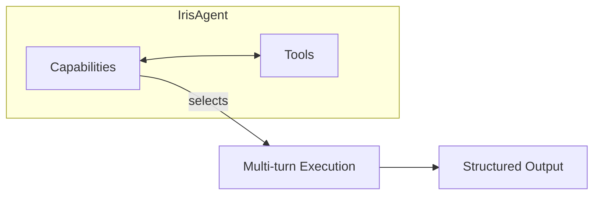
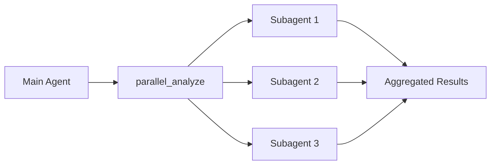

# Architecture Overview

Git-Iris is built on an **agent-first architecture** where intelligent decisions are made by Iris, an LLM-driven agent powered by [Rig 0.42](https://docs.rs/rig/0.42.0). Rather than dumping context upfront, Iris dynamically explores codebases using tool calls, gathering precisely what she needs.

## Core Philosophy

### LLM-First Decision Making

Git-Iris rejects traditional heuristic-based approaches. Instead:

- **The LLM makes all intelligent decisions** — No hardcoded rules for commit message formatting, code review priorities, or changeset analysis
- **Tools provide data, not decisions** — Tools like `git_diff` return structured information; Iris interprets meaning and significance
- **Context is dynamic** — Iris gathers context through tool calls rather than receiving a massive upfront dump

This design enables Git-Iris to:

- Adapt to any project style without configuration
- Understand semantic changes beyond surface-level diffs
- Scale from tiny commits to massive refactors through intelligent context management

### Agent-Tool-Capability Pattern



The unified agent combines **capabilities** (task definitions) with **tools** (context gathering):

| Capabilities          | Tools              | Output Types           |
| --------------------- | ------------------ | ---------------------- |
| `commit.toml`         | `git_diff`         | `GeneratedMessage`     |
| `review.toml`         | `git_log`          | `Review` (structured)  |
| `pr.toml`             | `file_read`        | `MarkdownPullRequest`  |
| `changelog.toml`      | `code_search`      | `MarkdownChangelog`    |
| `release_notes.toml`  | `parallel_analyze` | `MarkdownReleaseNotes` |
| `chat.toml`           | `workspace`        | `PlainText`            |
| `semantic_blame.toml` | `git_diff`         | `String`               |
| `verify.toml`         | (any core tool)    | `Critique` (internal)  |

**Execution flow:** Capability selects prompt → Iris calls tools (up to 50 turns) → Returns structured JSON → Optional critic verification pass (`verify_response_if_enabled`) re-runs once if material issues are flagged.

## Architecture Components

### 1. IrisAgent — The Unified Agent

**Location:** `src/agents/iris.rs`

A single agent implementation that handles all Git-Iris tasks through **capability switching**:

```rust
pub struct IrisAgent {
    provider: String,
    model: String,
    fast_model: Option<String>,
    current_capability: Option<String>,
    // ...
}
```

**Key responsibilities:**

- Load capability TOML files to determine task prompt and output schema
- Attach tools via Rig's builder pattern
- Execute multi-turn agent loops (up to 50 tool calls)
- Parse and validate structured JSON responses
- Handle streaming responses for real-time TUI updates

**Why one agent?** Simplifies code, enables tool reuse, and provides consistent behavior across all capabilities.

### 2. Capabilities — Task Definitions

**Location:** `src/agents/capabilities/*.toml`

TOML files that define:

- `task_prompt` — Instructions for Iris on how to approach the task
- `output_type` — Expected JSON schema (maps to Rust types)

Example from `commit.toml`:

```toml
name = "commit"
description = "Generate commit messages from staged changes"
output_type = "GeneratedMessage"

task_prompt = """
Generate a commit message for the staged changes.

## Context Gathering
`project_docs(doc_type="context")` returns a compact snapshot of the README and agent instructions.
Start with `git_diff()` for change evidence, then pull docs when repository conventions or product framing matter.

## Tools Available
- `git_diff()` - Get staged changes with relevance scores
- `git_log(count=5)` - Recent commits for style reference
...
"""
```

Capabilities are **embedded at compile time** using `include_str!()`, making Git-Iris fully portable.

See: [Capabilities Documentation](./capabilities.md)

### 3. Tools — Information Gathering

**Location:** `src/agents/tools/`

Tools are Rig-compatible functions that Iris calls to gather information. Eleven **core tools** are wired into every main agent and subagent through the `attach_core_tools!` macro; the remaining tools are attached only to the main agent (or only in Studio chat mode).

| Tool                | Purpose                                                           |
| ------------------- | ----------------------------------------------------------------- |
| `git_status`        | Repository status (branch + changed file list)                    |
| `git_diff`          | Staged or range diff with relevance scoring                       |
| `git_log`           | Recent commits or commits in a range                              |
| `git_show`          | Inspect a historical commit's message, stat, and patch            |
| `git_changed_files` | List changed files between commits/branches or staged             |
| `git_blame`         | Line-level blame for a file range plus recent commits touching it |
| `file_read`         | Read file contents and targeted line ranges                       |
| `code_search`       | ripgrep-backed search for patterns/symbols                        |
| `repo_map`          | Compact ranked map of source files, definitions, imports          |
| `static_analysis`   | Run installed linters (clippy, ruff, biome/oxlint, golangci-lint) |
| `project_docs`      | Read README, AGENTS.md, CLAUDE.md, or compact `context` snapshot  |
| `workspace`         | Iris's persistent notes and task tracking (main agent only)       |
| `parallel_analyze`  | Spawn concurrent subagents for large changesets (main agent only) |
| `git_repo_info`     | Repository metadata: branch, remote, path (main agent only)       |

**Tool Registry:** The `attach_core_tools!` macro (`src/agents/tools/registry.rs`) ensures consistent tool sets across main agents and subagents, preventing drift. Delegation tools (`workspace`, `parallel_analyze`, the sub-agent itself) are excluded from subagents to prevent recursion.

See: [Tools Documentation](./tools.md)

### 4. Structured Output — Type-Safe Responses

**Location:** `src/types/`

All Iris responses are validated against JSON schemas:

```rust
pub enum StructuredResponse {
    CommitMessage(GeneratedMessage),       // { emoji, title, message, completion_message }
    PullRequest(MarkdownPullRequest),      // { content: String }
    Changelog(MarkdownChangelog),          // { content: String }
    ReleaseNotes(MarkdownReleaseNotes),    // { content: String }
    Review(crate::types::Review),          // structured { summary, metadata, findings[], stats }
    SemanticBlame(String),                 // plain text
    PlainText(String),                     // fallback
}
```

The `Review` variant is **structured** rather than a markdown wrapper: it carries a parseable list of `Finding` records (id, severity, confidence, file, line range, category, body, optional suggested fix, evidence references). See [Output Validation](./output.md) for the full schema.

**Validation and recovery** handles malformed LLM output gracefully, attempting repairs before failing.

See: [Output Validation Documentation](./output.md)

### 5. Context Strategy — Relevance Scoring

**Location:** `src/agents/tools/git.rs`

Iris adapts her approach based on changeset size. Sizes are computed inline inside `format_diff_output` (no `ChangesetSize` enum) and surfaced in the `git_diff` header as the **Size** and **Guidance** lines:

| Size       | Criteria                          | Guidance                                               |
| ---------- | --------------------------------- | ------------------------------------------------------ |
| `Small`    | ≤3 files **and** <100 lines       | Focus on all files equally                             |
| `Medium`   | ≤10 files **and** <500 lines      | Prioritize files with >60% relevance                   |
| `Large`    | anything bigger                   | Use `files=['path1','path2']` with `detail="standard"` |
| `Filtered` | when the `files` argument is used | Show only the requested files                          |

For genuinely huge changesets (multiple modules touched), Iris is instructed by capability prompts to fall back to `parallel_analyze` so each subagent gets its own context window.

**Relevance scoring** considers:

- Change type (added > modified > deleted)
- File type (source code > config > docs)
- Path patterns (src/ > test/)
- Diff size (substantive changes preferred)
- Semantic patterns (function additions, type definitions)

See: [Context Strategy Documentation](./context.md)

## Multi-Turn Execution

Iris executes in **multi-turn mode**, allowing up to 50 tool calls per task:

1. **Planning** — Iris reads the capability prompt and user request
2. **Analysis** — Calls tools (`git_diff`, `project_docs`, `file_read`, etc.)
3. **Deep Dive** — May call `parallel_analyze` or `analyze_subagent` for large tasks
4. **Synthesis** — Returns structured JSON matching the expected schema
5. **Validation** — Output validator ensures JSON is well-formed
6. **Critic verification (optional)** — `verify_response_if_enabled` loads the `verify` capability and critiques the artifact against repository evidence; if it returns `requires_revision`, Iris regenerates the artifact once with the critic's revision prompt appended. The pass runs by default for `review`, `pr`, `changelog`, and `release_notes`; `commit` requires an explicit `--critic` opt-in. All critic runs are gated by `Config.critic_enabled` (default `true`).

**Why 50 turns?** Complex tasks like PRs and release notes may require analyzing many files and commits. Iris knows when to stop, so we give generous headroom.

## Subagent Architecture

For large changesets, Iris spawns **independent subagents** via `parallel_analyze`:



**Example task distribution:**

| Subagent | Task                      | Focus                 |
| -------- | ------------------------- | --------------------- |
| 1        | Analyze auth/ changes     | Authentication module |
| 2        | Review API endpoints      | REST/GraphQL layer    |
| 3        | Check database migrations | Schema changes        |

Each subagent:

- Runs concurrently with its own context window (default timeout 120 s, default turn budget 20)
- Has access to the same 11 core tools attached by `attach_core_tools!`, but no delegation tools (no recursion)
- Returns a focused analysis
- Uses the **fast model** for cost efficiency

**Configurable budgets.** Both `Config.subagent_timeout_secs` (default 120) and `Config.subagent_max_turns` (default 20) tune subagent resource use. `parallel_analyze` also accepts an optional `max_turns` argument (clamped to 1..=100) so the LLM can request a larger budget for sweeping repository searches or a smaller one to cap cost.

**Prevents:** Context overflow, token limit errors, information loss

## Provider Abstraction

Git-Iris supports multiple LLM providers through rig's unified interface. There is no `DynClientBuilder`; instead `IrisAgent::build_agent` dispatches on the configured provider string and calls one of `provider::openai_builder`, `provider::anthropic_builder`, or `provider::gemini_builder`, returning a `DynAgent` enum that wraps the provider-specific `Agent<M>`.

| Provider  | Default Model      | Fast Model                  |
| --------- | ------------------ | --------------------------- |
| OpenAI    | `gpt-6-astra`      | `gpt-5.6-luna`              |
| Anthropic | `claude-opus-5`    | `claude-haiku-4-5-20251001` |
| Google    | `gemini-3.8-flash` | `gemini-3.5-flash-lite`     |

Provider switching is transparent — the same capabilities and tools work across all backends.

**Anthropic prompt caching is always-on.** `anthropic_agent_builder` wraps every Anthropic completion model with `.with_automatic_caching()` (`src/agents/provider.rs:194-204`). The API places a `cache_control` breakpoint on the last cacheable block and advances it as the conversation grows, so multi-turn tool loops re-bill prior turns at the cached rate. Token-usage debug surfaces `cache_creation_input_tokens` and `cached_input_tokens` alongside the standard input/output totals.

## Design Decisions

### Why Rig?

- **Agent-as-tool composition** — Subagents are just tools from the main agent's perspective
- **Provider abstraction** — Swap between OpenAI/Anthropic/Google without configuration changes
- **Tool system** — Clean trait-based tools with automatic schema generation
- **Multi-turn support** — Built-in agentic loops with tool calling

### Why Capability Switching?

- **Single agent codebase** — No duplication between commit/review/PR agents
- **Shared tool logic** — One implementation of `git_diff`, used everywhere
- **Easy testing** — Test one agent with different prompts
- **Maintainability** — Update tool behavior in one place

### Why Structured Output?

- **Predictable parsing** — JSON schemas guarantee parseable responses
- **Type safety** — Rust types enforce correctness
- **Error recovery** — Validator can repair common LLM mistakes
- **Separation of concerns** — LLM focuses on content, not format

### Why Multi-Turn?

- **Adaptive exploration** — Iris decides what to read based on what she learns
- **Large changeset support** — Can analyze 20+ files through multiple tool calls
- **Context efficiency** — Only loads files/diffs that are relevant
- **Natural workflow** — Mimics how humans review code (breadth → depth)

## Next Steps

- [Agent System](./agent.md) — Deep dive into `IrisAgent` implementation
- [Capabilities](./capabilities.md) — How to create custom capabilities
- [Tools](./tools.md) — Tool development and the tool registry
- [Output Validation](./output.md) — JSON schema validation and recovery
- [Context Strategy](./context.md) — Relevance scoring and adaptive context
