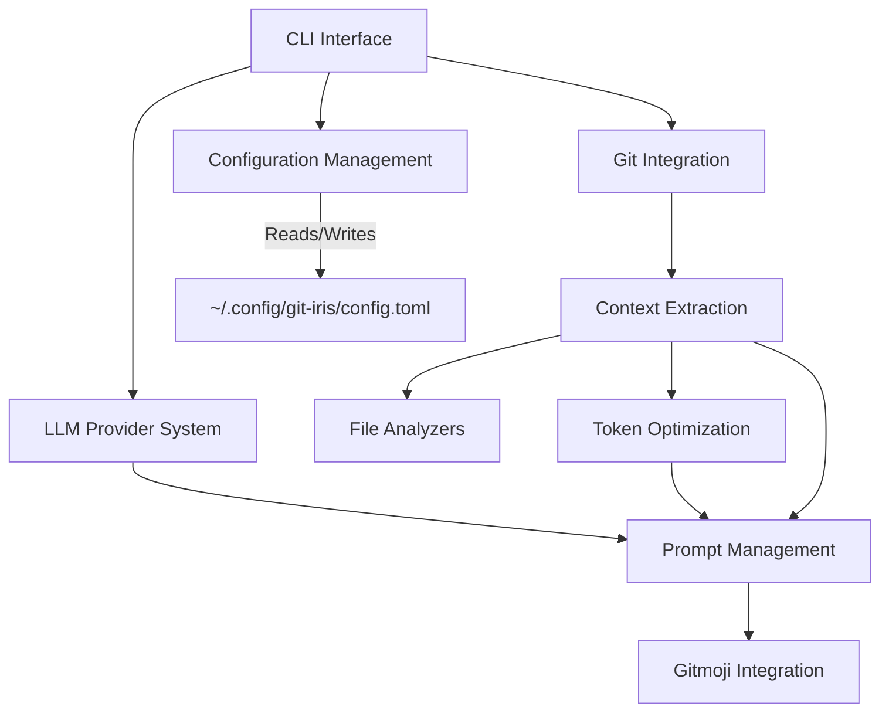

# Git-Iris Architecture Design

## 1. High-Level Overview

Git-Iris is a Rust-based command-line tool that leverages AI to generate meaningful Git commit messages. The application integrates with Git repositories, analyzes code changes, and uses Language Learning Models (LLMs) to produce context-aware commit messages.

## 2. Core Components

### 2.1 CLI Interface
- Handles user input and output
- Parses command-line arguments using `clap`
- Implements the interactive commit process

### 2.2 Git Integration
- Interfaces with Git repositories using the `git2` library
- Retrieves relevant Git information (diff, branch name, recent commits)
- Applies the final commit message

### 2.3 LLM Provider System
- Manages communication with various LLM APIs (OpenAI, Claude)
- Handles API authentication and rate limiting
- Implements a plugin-like system for easy addition of new providers

### 2.4 Context Extraction
- Analyzes Git diffs and repository structure
- Extracts relevant information for commit message generation
- Implements language-specific analyzers for improved context

### 2.5 Prompt Management
- Constructs prompts for LLMs based on extracted context and user preferences
- Manages system prompts and user-defined custom instructions

### 2.6 Token Optimization
- Ensures prompts fit within token limits of LLM providers
- Implements intelligent truncation strategies to maximize relevant information

### 2.7 Configuration Management
- Handles user configuration (API keys, preferences, custom instructions)
- Manages provider-specific settings
- Uses `~/.config/git-iris/config.toml` as the configuration file location

### 2.8 Gitmoji Integration
- Provides optional Gitmoji support for commit messages
- Manages Gitmoji mappings and integration logic

## 3. Data Flow

1. User invokes Git-Iris via CLI
2. CLI Interface parses input and retrieves configuration from `~/.config/git-iris/config.toml`
3. Git Integration extracts repository information
4. Context Extraction analyzes changes and builds context
5. Token Optimization ensures context fits within limits
6. Prompt Management constructs the full prompt
7. LLM Provider System sends the prompt to the selected LLM API
8. CLI Interface presents the generated message to the user
9. Interactive process allows user refinement
10. Git Integration applies the final commit (if confirmed)

## 4. Key Design Patterns and Principles

### 4.1 Plugin Architecture for LLM Providers
- Allows easy addition of new LLM providers
- Uses trait-based polymorphism for provider implementations

### 4.2 Command Pattern for CLI Operations
- Encapsulates each major operation (generate, config) as a command object
- Facilitates easy addition of new CLI commands

### 4.3 Strategy Pattern for File Analyzers
- Enables language-specific analysis of changed files
- Allows for easy extension to support new file types

### 4.4 Factory Method for Provider Creation
- Centralizes provider instance creation
- Simplifies the process of adding new providers

### 4.5 Dependency Injection
- Uses dependency injection for better testability and flexibility
- Allows easy swapping of components (e.g., for testing)

## 5. Error Handling and Logging

- Utilizes `anyhow` for flexible error handling
- Implements a custom logging system with optional file output
- Provides verbose mode for detailed debugging information

## 6. Configuration Management

- Uses TOML for the configuration file format
- Stores configuration in `~/.config/git-iris/config.toml`
- Implements a command-line interface for easy configuration updates

## 7. Testing Strategy

- Unit tests for individual components
- Integration tests for end-to-end workflows
- Mock LLM providers for testing without API calls
- Property-based testing for complex components (e.g., token optimization)

## 8. Performance Considerations

- Efficient token counting and optimization
- Caching of repeated operations (e.g., file analysis results)
- Asynchronous API calls to improve responsiveness

## 9. Security Considerations

- Secure storage of API keys in the configuration file
- No transmission of sensitive data beyond necessary API calls
- Clear guidelines for users on API key management

## 10. Extensibility

The architecture is designed for easy extension in several areas:

- Adding new LLM providers
- Implementing new file type analyzers
- Extending CLI commands
- Adding new configuration options

## 11. Future Improvements

- GUI interface for more user-friendly interaction
- Integration with CI/CD pipelines for automated commit message generation
- Support for more Git hosting platforms (GitHub, GitLab, Bitbucket)
- Machine learning model for improving suggestions based on user feedback
- Support for project-specific configuration files (e.g., `.git-iris.toml` in project root)

## 12. Component Diagram



## 13. Configuration File Management

The configuration file (`~/.config/git-iris/config.toml`) is a crucial part of Git-Iris. Here's how it's managed:

- The `Config` struct in `config.rs` is responsible for loading, parsing, and saving the configuration file.
- The `get_config_path()` function determines the correct path for the configuration file:
  ```rust
  fn get_config_path() -> Result<PathBuf> {
      let mut path = config_dir().ok_or_else(|| anyhow!("Unable to determine config directory"))?;
      path.push("git-iris");
      std::fs::create_dir_all(&path)?;
      path.push("config.toml");
      Ok(path)
  }
  ```
- This ensures that the configuration file is stored in the standard location for user-specific configuration files across different operating systems.
- The `Config::load()` method reads and parses the configuration file, creating a default configuration if the file doesn't exist.
- The `Config::save()` method writes the current configuration back to the file.

## 14. Error Handling Strategy

Git-Iris employs a robust error handling strategy:

- The `anyhow` crate is used for flexible error handling and propagation.
- Custom error types are defined for specific error cases where more context is needed.
- Errors are logged and presented to the user in a friendly format.
- In verbose mode, more detailed error information is provided for debugging purposes.

## 15. Asynchronous Operations

Git-Iris uses asynchronous programming to improve performance and responsiveness:

- The `tokio` runtime is used for asynchronous operations.
- API calls to LLM providers are made asynchronously.
- The main application logic remains synchronous for simplicity, with async operations contained within specific components.

## 16. Resource Management

Git-Iris is designed to be efficient with system resources:

- Memory usage is optimized by processing Git diffs and file contents in chunks where possible.
- Temporary files are used for large diffs or file contents to avoid excessive memory usage.
- Resources like API connections are managed using Rust's RAII principles to ensure proper cleanup.

## 17. Internationalization and Localization

While not currently implemented, the architecture is designed to easily support internationalization in the future:

- User-facing strings are centralized for easy translation.
- The CLI interface is structured to allow for language-specific output.

## 18. Logging and Diagnostics

Git-Iris includes a comprehensive logging system:

- Log messages are categorized by severity (debug, info, warning, error).
- In verbose mode, detailed logs are written to a file for debugging purposes.
- The logging system is designed to be non-intrusive during normal operation but highly informative when needed for troubleshooting.

## 19. Update Mechanism

While not part of the initial release, the architecture includes considerations for future self-update capabilities:

- A version check mechanism can be implemented to compare the current version with the latest release.
- An update command can be added to the CLI to facilitate easy updates.

This architecture design provides a solid foundation for Git-Iris, allowing for maintainability, extensibility, and robust performance as the project grows and evolves. The use of standard configuration file locations and well-structured components ensures that Git-Iris integrates well with users' existing workflows and system expectations.