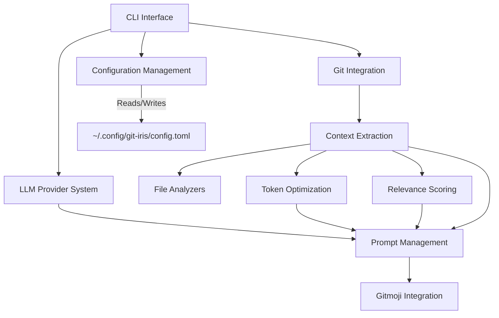

# Git-Iris Architecture Design

## 1. High-Level Overview

Git-Iris is a Rust-based command-line tool that leverages AI to generate meaningful Git commit messages. The application integrates with Git repositories, analyzes code changes, and uses Language Learning Models (LLMs) to produce context-aware commit messages.

## 2. Core Components

### 2.1 CLI Interface
- Handles user input and output
- Parses command-line arguments using `clap`
- Implements the interactive commit process

### 2.2 Git Integration
- Interfaces with Git repositories using the `git2` library
- Retrieves relevant Git information (diff, branch name, recent commits)
- Applies the final commit message

### 2.3 LLM Provider System
- Manages communication with various LLM APIs (OpenAI, Claude, Ollama)
- Handles API authentication and rate limiting
- Implements a plugin-like system for easy addition of new providers

### 2.4 Context Extraction
- Analyzes Git diffs and repository structure
- Extracts relevant information for commit message generation
- Implements language-specific analyzers for improved context

### 2.5 Prompt Management
- Constructs prompts for LLMs based on extracted context and user preferences
- Manages system prompts and user-defined custom instructions

### 2.6 Token Optimization
- Ensures prompts fit within token limits of LLM providers
- Implements intelligent truncation strategies to maximize relevant information

### 2.7 Configuration Management
- Handles user configuration (API keys, preferences, custom instructions)
- Manages provider-specific settings
- Uses `~/.config/git-iris/config.toml` as the configuration file location

### 2.8 Gitmoji Integration
- Provides optional Gitmoji support for commit messages
- Manages Gitmoji mappings and integration logic

### 2.9 File Analyzers
- Implements language-specific analyzers for various file types
- Extracts relevant information from changed files to provide better context

### 2.10 Relevance Scoring
- Implements a scoring system to determine the relevance of changes
- Helps prioritize information for inclusion in the commit message

### 2.11 Changelog Generator
- Analyzes commit history between specified Git references
- Generates structured changelogs based on commit messages and code changes
- Supports different detail levels and customization options

### 2.12 Release Notes Generator
- Builds upon the Changelog Generator to create comprehensive release notes
- Incorporates additional context and summaries for release documentation
- Supports customization through presets and user instructions

### 2.13 Instruction Preset System
- Manages predefined sets of instructions for different commit styles and documentation formats
- Allows users to quickly switch between different documentation styles
- Supports custom presets for project-specific needs

## 3. Data Flow

1. User invokes Git-Iris via CLI
2. CLI Interface parses input and retrieves configuration from `~/.config/git-iris/config.toml`
3. Git Integration extracts repository information
4. Context Extraction analyzes changes and builds context
5. File Analyzers process changed files and extract relevant information
6. Relevance Scoring prioritizes the extracted information
7. Token Optimization ensures context fits within limits
8. Prompt Management constructs the full prompt
9. LLM Provider System sends the prompt to the selected LLM API
10. CLI Interface presents the generated content to the user
11. For commit messages: Interactive process allows user refinement
12. For changelogs and release notes: Content is displayed or saved to file
13. Git Integration applies the final commit (if confirmed for commit messages)

## 4. Key Design Patterns and Principles

### 4.1 Plugin Architecture for LLM Providers
- Allows easy addition of new LLM providers
- Uses trait-based polymorphism for provider implementations

### 4.2 Command Pattern for CLI Operations
- Encapsulates each major operation (generate, config) as a command object
- Facilitates easy addition of new CLI commands

### 4.3 Strategy Pattern for File Analyzers
- Enables language-specific analysis of changed files
- Allows for easy extension to support new file types

### 4.4 Factory Method for Provider Creation
- Centralizes provider instance creation
- Simplifies the process of adding new providers

### 4.5 Dependency Injection
- Uses dependency injection for better testability and flexibility
- Allows easy swapping of components (e.g., for testing)

## 5. Error Handling and Logging

- Utilizes `anyhow` for flexible error handling
- Implements a custom logging system with optional file output
- Provides verbose mode for detailed debugging information

## 6. Configuration Management

- Uses TOML for the configuration file format
- Stores configuration in `~/.config/git-iris/config.toml`
- Implements a command-line interface for easy configuration updates

## 7. Testing Strategy

- Unit tests for individual components
- Integration tests for end-to-end workflows
- Mock LLM providers for testing without API calls
- Property-based testing for complex components (e.g., token optimization)

## 8. Performance Considerations

- Efficient token counting and optimization
- Caching of repeated operations (e.g., file analysis results)
- Asynchronous API calls to improve responsiveness

## 9. Security Considerations

- Secure storage of API keys in the configuration file
- No transmission of sensitive data beyond necessary API calls
- Clear guidelines for users on API key management

## 10. Extensibility

The architecture is designed for easy extension in several areas:

- Adding new LLM providers
- Implementing new file type analyzers
- Extending CLI commands
- Adding new configuration options

## 11. Future Improvements

- GUI interface for more user-friendly interaction
- Integration with CI/CD pipelines for automated commit message generation
- Support for more Git hosting platforms (GitHub, GitLab, Bitbucket)
- Machine learning model for improving suggestions based on user feedback
- Support for project-specific configuration files (e.g., `.git-iris.toml` in project root)
- Advanced customization options for changelog and release notes templates

## 12. Component Diagram

## 13. LLM Provider System

The LLM Provider System is designed to be extensible and support multiple AI providers:

- Implements a common `LLMProvider` trait for all providers
- Currently supports OpenAI, Claude, and Ollama
- Each provider has its own implementation of API communication
- Providers can have custom configuration options

## 14. File Analyzer System

The File Analyzer System allows for language-specific analysis of changed files:

- Implements a `FileAnalyzer` trait for all file type analyzers
- Supports various languages and file types (Rust, JavaScript, Python, Java, C/C++, etc.)
- Extracts relevant information such as modified functions, classes, and structures
- Provides context for more accurate commit message generation

## 15. Token Optimization

The Token Optimization system ensures that the context provided to LLMs fits within token limits:

- Implements intelligent truncation strategies
- Prioritizes the most relevant information
- Ensures the most important context is preserved within token limits

## 16. Interactive Commit Process

The Interactive Commit Process provides a user-friendly interface for reviewing and refining commit messages:

- Allows navigation through multiple generated messages
- Provides options for editing messages and regenerating with new instructions
- Implements a visually appealing CLI interface with color coding and formatting

## 17. Relevance Scoring

The Relevance Scoring system helps prioritize information for inclusion in commit messages:

- Assigns scores to different types of changes (e.g., new files, modified functions)
- Uses heuristics to determine the importance of specific changes
- Helps focus the AI on the most significant aspects of the commit

This architecture provides a solid foundation for Git-Iris, allowing for maintainability, extensibility, and robust performance as the project grows and evolves. The modular design and use of well-established design patterns ensure that the system can be easily extended and modified as new requirements emerge.

## 18. Changelog Generation System

The Changelog Generation system is responsible for creating structured changelogs based on Git history:

- Analyzes commits between specified Git references
- Categorizes changes based on commit messages and file modifications
- Supports different levels of detail (minimal, standard, detailed)
- Integrates with the Instruction Preset System for customizable formatting
- Utilizes the LLM Provider System for generating summaries and descriptions

## 19. Release Notes Generation System

The Release Notes Generation system builds upon the Changelog Generation system to create comprehensive release documentation:

- Incorporates changelog information
- Adds high-level summaries and overviews of changes
- Supports customization through instruction presets and user-defined guidelines
- Utilizes the LLM Provider System for generating user-friendly content

## 20. Instruction Preset System

The Instruction Preset System manages predefined sets of instructions for various documentation styles:

- Provides built-in presets for common commit message and documentation formats
- Allows users to create and save custom presets
- Integrates with the Prompt Management system to guide LLM output
- Supports different presets for commit messages, changelogs, and release notes
